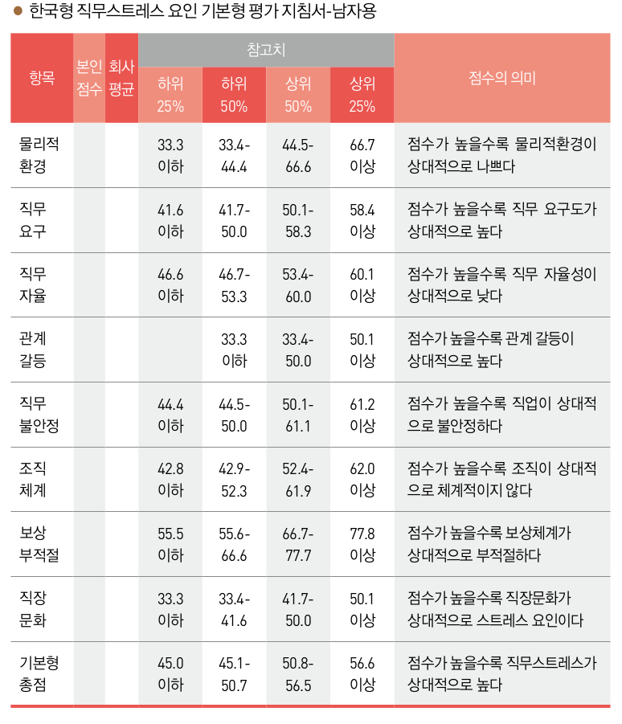

```{r setup, include=FALSE}
options(htmltools.dir.version = FALSE)
knitr::opts_chunk$set(echo = F, fig.align = "center", warning = F, message = F)
library(knitr);library(DT);library(rmarkdown);library(knitr)
```


layout: true

<div class="my-footer"><span><a href="https://www.zarathu.com">Zarathu Co.,Ltd</a>   
&emsp;&emsp;&emsp;&emsp;&emsp;&emsp;&emsp;&emsp;&emsp;&emsp;&emsp;&emsp;&emsp;
&emsp;&emsp;&emsp;&emsp;&emsp;&emsp;&emsp;&emsp;&emsp;&emsp;&emsp;&emsp;&emsp;
<a href="https://github.com/jinseob2kim">김진섭</a></span></div> 

---

# Executive Summary 

* 스트레스: **직무스트레스/감정노동 평가**

* 치매: MMSE-K

* 눈: 6대 안질환 자가진단

* 치아: 잇목(PQ) 건강지수

* 수면: 앱워스 졸음증 척도

* 요통: 요통 자가진단 질문

* 우울증: 자가진단 척도(CES-D) 

* 전립샘: 국제전립샘 증상점수표(IPSS)

* 골다공증: 골절위험도 평가(FRAX) 


---

# 직무스트레스 평가 

산업안전보건법에 사업주의 의무로 명시됨.


---

# [한국인 직무스트레스 측정도구](http://kras.kosha.or.kr/health/health_tab02)

```{r, out.width="65%", fig.align = "center"}

```


---

```{r, out.width="65%", fig.align = "center"}

```


---
# 점수계산 

```{r, out.width="100%", fig.align = "center"}

```

---

```{r, out.width="60%", fig.align = "center"}

```

---

```{r, out.width="60%", fig.align = "center"}

```


---
# 감정노동

- [산업안전보건법에 "고객의 폭언 등으로 인한 건강장해 예방조처" 를 사업주의 의무사항으로 추가](https://blog.naver.com/PostView.nhn?blogId=hamrang&logNo=221384606735&categoryNo=0&parentCategoryNo=0&viewDate=&currentPage=1&postListTopCurrentPage=1&from=postView) 

- 산업안전보건법 26조 2항: **"사업주는 고객의 폭언 등으로 인하여 고객 응대 근로자에게 건강장해가 발생하거나 발생할 현저한 우려가 있는 경우에는 업무의 일시적 중단 또는 전환 등 조처를 해야 한다"** 

- 판매직 노동자 등은 고객에게 폭언이나 정신적 피해를 당했을 경우 사업주에게 업무 중단 등을 요구할 수 있고, 사업주가 이런 요구를 했다는 이유로 해당 노동자를 해고하거나 그 밖에 불리한 처우를 하면 5천만원 이하의 과태료를 부과할 수 있다.


---

```{r, out.width="70%", fig.align = "center"}
include_graphics("fig/emotion.png")
```

---

```{r, out.width="100%", fig.align = "center"}
include_graphics("fig/point_emotion.png")
```


---

# 치매: MMSE-K


```{r, out.width="45%", fig.align = "center"}
include_graphics("fig/mmse.png")
```

**24점 이상 정상**, 20-23점 의심, 19점 이하 전문의 확진 필요

---
# 6대 안과질환 자기진단테스트 

[서울/부산 밝은세상 안과 개발](http://www.6eye.co.kr/html/main.php?sc_etp_mmbr_seq=1)

- 기본형: 22개 설문, 정밀형 32개 설문

```{r, out.width="60%", fig.align = "center"}
include_graphics("https://postfiles.pstatic.net/MjAxODEyMjZfMTUg/MDAxNTQ1ODAxMzAwMzUw.v4XgD0EK4YYrnxbAoiZmSiW5gEeh4itVa5qBUUtK9cMg.N_-6xYADTP3kGji4khYx1ZAOt8v1u43P7J0pBUydom0g.PNG.i_loveeye/6%EB%8C%80%EC%A7%88%ED%99%98.png?type=w773")
```

---
# 잇몸(PQ) 건강지수

[대한 치주과학회 개발](http://dkbrand.co.kr/information/periodontitis.php)


```{r, out.width="100%", fig.align = "center"}

```

---
# 졸음증 척도

[앱워스(Epworth) 졸음증 척도](http://m.psychiatricnews.net/news/articleView.html?idxno=14692)

```{r, out.width="80%", fig.align = "center"}
include_graphics("https://t2.daumcdn.net/thumb/R720x0/?fname=http://t1.daumcdn.net/brunch/service/user/74Qc/image/lIQHHy326JR9I0ZdUm7tK7xLlgc.JPG")
```

---
# 판정

0~8점  -------------------------------- 건강한 수준의 졸음

9~12점 --------------------------------가벼운 수준의 졸음

13~16점 -------------------------------중간 수준의 졸음

17점 이상 ------------------------------심각한 수준의 졸음

합산 점수가 8점 이상이라면 졸음에 문제가 있는 수준, 13점 이상은 수면장애가 의심되므로 검진을 받아볼 필요가 있다.


---
# 요통 자가진단 

[국가건강정보포털](http://health.cdc.go.kr/health/static/diagnostic/q008.html)

```{r, out.width="70%", fig.align = "center"}
include_graphics("https://health.cdc.go.kr/health/download/getResource.do?type=3&fileName=OHJ/EYBrK9+5HyfcUE4knQ==_~_w+Ly9dyC6kevhElQ+hBimw==")
```


---
# 우울증 자가진단

[자가우울척도검사(CES-D)](http://health.cdc.go.kr/health/mobileweb/content/group_view.jsp?CID=8A181E17B0)

```{r, out.width="65%", fig.align = "center"}
include_graphics("https://health.chosun.com/site/data/img_dir/2020/03/10/2020031001782_0.jpg")
```

---
# 평가

총 60점

- 0점 ~ 15점 : 편안한 상태입니다. 지속적으로 정신건강에 관심을 갖고 예방을 위해 년1회 정기검사도 잊지 마세요.


- 16점 ~ 24점 : 가벼운 우울감을 겪고 있는 상태입니다. 우울증 예방을 위해 운동, 여가활동, 대인관계 맺기 등 즐거움을 주는 활동에 적극적으로 참여해보세요.

- 25점 이상 : 다양한 우울증상으로 일상생활에 영향을 주고 있는 상태입니다. 이러한 상태가 2주 이상 지속된다면 전문가와의 상담을 반드시 받아보세요.
 
 
---
# 전립샘 비대증 테스트 

[국제전립샘 증상점수표(IPSS)](http://health.cdc.go.kr/health/mobileweb/content/group_view.jsp?CID=1F080DBAA0)

```{r, out.width="90%", fig.align = "center"}
include_graphics("https://health.cdc.go.kr/health/download/getResource.do?type=3&fileName=F8XZPAjcRwJGd1/PEYbfuw==_~_1OKEqk1c8jXAUpSv5qaAZg== ")
```

---
# [골절 위험도 테스트](http://m.kmedinfo.co.kr/news/articleView.html?idxno=51907)

[FRAX (fracture risk assessment tool)](https://www.sheffield.ac.uk/FRAX/tool.aspx?country=25)
- WHO 개발, 10년 내 골절위험도 계산. 나라별로 알고리즘 다름.
- [간이검사](http://m.nhic.or.kr/comWeb/wo/d/wcdc03.html) 

```{r, out.width="70%", fig.align = "center"}
include_graphics("https://t1.daumcdn.net/cfile/tistory/241D8C495493ADA529")
```


---

class: center, middle

# END


