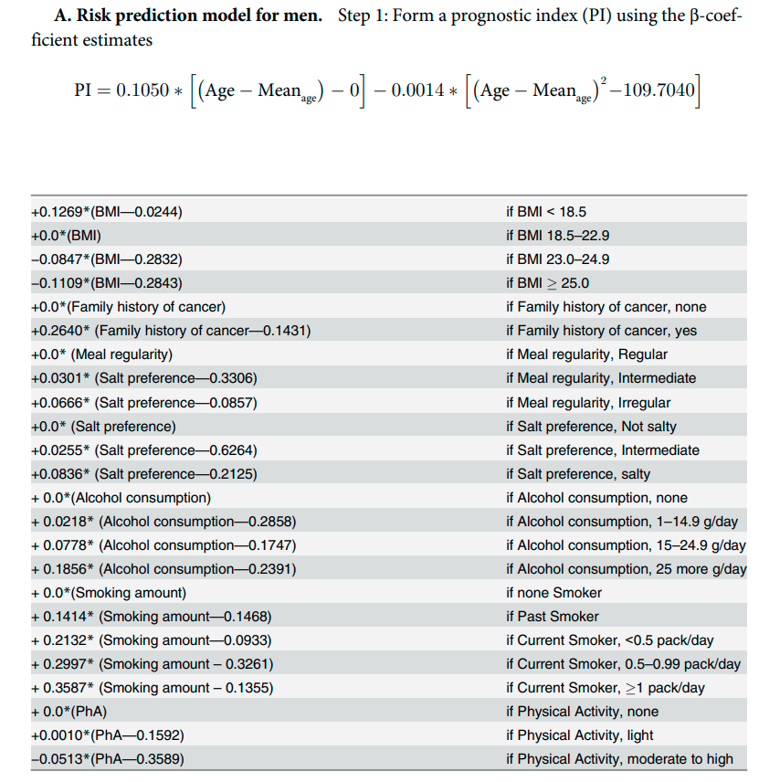

```{r setup, include=FALSE}
options(htmltools.dir.version = FALSE)
knitr::opts_chunk$set(echo = F, fig.align = "center", warning = F, message = F)
library(knitr);library(DT);library(rmarkdown);library(knitr)
```


layout: true

<div class="my-footer"><span><a href="https://www.zarathu.com">Zarathu Co.,Ltd</a>   
&emsp;&emsp;&emsp;&emsp;&emsp;&emsp;&emsp;&emsp;&emsp;&emsp;&emsp;&emsp;&emsp;
&emsp;&emsp;&emsp;&emsp;&emsp;&emsp;&emsp;&emsp;&emsp;&emsp;&emsp;&emsp;&emsp;
<a href="https://github.com/jinseob2kim">김진섭</a></span></div> 

---

# Executive Summary 

* 스트레스: 직무스트레스/감정노동 평가

* 치매: MMSE-K

* 눈: 6대 안질환 자가진단

* 치아: 잇몸(PQ) 건강지수

* 수면: 앱워스 졸음증 척도

* 요통: 요통 자가진단 질문

* 우울증: 자가진단 척도(CES-D) 

* 전립샘: 국제전립샘 증상점수표(IPSS)

* 골다공증: 골절위험도 평가(FRAX) 

* 간: 섬유화지표(FIB-4, NAFLD)

* 콩팥: 추정사구체여과율(eGFR)


---

# 직무스트레스 평가 

산업안전보건법에 사업주의 의무로 명시됨.


---

# [한국인 직무스트레스 측정도구](http://kras.kosha.or.kr/health/health_tab02)

```{r, out.width="65%", fig.align = "center"}
include_graphics("fig/quest.png")
```


---

```{r, out.width="65%", fig.align = "center"}
include_graphics("fig/qq.png")
```


---
# 점수계산 

```{r, out.width="100%", fig.align = "center"}
include_graphics("fig/point.png")
```

---

```{r, out.width="60%", fig.align = "center"}
include_graphics("fig/man.png")
```

---

```{r, out.width="60%", fig.align = "center"}
include_graphics("fig/woman.png")
```


---
# 감정노동

- [산업안전보건법에 "고객의 폭언 등으로 인한 건강장해 예방조처" 를 사업주의 의무사항으로 추가](https://blog.naver.com/PostView.nhn?blogId=hamrang&logNo=221384606735&categoryNo=0&parentCategoryNo=0&viewDate=&currentPage=1&postListTopCurrentPage=1&from=postView) 

- 산업안전보건법 26조 2항: **"사업주는 고객의 폭언 등으로 인하여 고객 응대 근로자에게 건강장해가 발생하거나 발생할 현저한 우려가 있는 경우에는 업무의 일시적 중단 또는 전환 등 조처를 해야 한다"** 

- 판매직 노동자 등은 고객에게 폭언이나 정신적 피해를 당했을 경우 사업주에게 업무 중단 등을 요구할 수 있고, 사업주가 이런 요구를 했다는 이유로 해당 노동자를 해고하거나 그 밖에 불리한 처우를 하면 5천만원 이하의 과태료를 부과할 수 있다.


---

```{r, out.width="70%", fig.align = "center"}
include_graphics("fig/emotion.png")
```

---

```{r, out.width="100%", fig.align = "center"}

```


---

# 치매: MMSE-K


```{r, out.width="45%", fig.align = "center"}

```

**24점 이상 정상**, 20-23점 의심, 19점 이하 전문의 확진 필요

---
# 6대 안과질환 자기진단테스트 

[서울/부산 밝은세상 안과 개발](http://www.6eye.co.kr/html/main.php?sc_etp_mmbr_seq=1)

- 기본형: 22개 설문, 정밀형 32개 설문

```{r, out.width="60%", fig.align = "center"}
include_graphics("https://postfiles.pstatic.net/MjAxODEyMjZfMTUg/MDAxNTQ1ODAxMzAwMzUw.v4XgD0EK4YYrnxbAoiZmSiW5gEeh4itVa5qBUUtK9cMg.N_-6xYADTP3kGji4khYx1ZAOt8v1u43P7J0pBUydom0g.PNG.i_loveeye/6%EB%8C%80%EC%A7%88%ED%99%98.png?type=w773")
```

---
# 잇몸(PQ) 건강지수

[대한 치주과학회 개발](http://dkbrand.co.kr/information/periodontitis.php)


```{r, out.width="100%", fig.align = "center"}
include_graphics("fig/PQ지수_설문지.jpg")
```

---
# 졸음증 척도

[앱워스(Epworth) 졸음증 척도](http://m.psychiatricnews.net/news/articleView.html?idxno=14692)

```{r, out.width="80%", fig.align = "center"}
include_graphics("https://t2.daumcdn.net/thumb/R720x0/?fname=http://t1.daumcdn.net/brunch/service/user/74Qc/image/lIQHHy326JR9I0ZdUm7tK7xLlgc.JPG")
```

---
# 판정

0~8점  -------------------------------- 건강한 수준의 졸음

9~12점 --------------------------------가벼운 수준의 졸음

13~16점 -------------------------------중간 수준의 졸음

17점 이상 ------------------------------심각한 수준의 졸음

합산 점수가 8점 이상이라면 졸음에 문제가 있는 수준, 13점 이상은 수면장애가 의심되므로 검진을 받아볼 필요가 있다.


---
# 요통 자가진단 

[국가건강정보포털](http://health.cdc.go.kr/health/static/diagnostic/q008.html)

```{r, out.width="70%", fig.align = "center"}
include_graphics("https://health.cdc.go.kr/health/download/getResource.do?type=3&fileName=OHJ/EYBrK9+5HyfcUE4knQ==_~_w+Ly9dyC6kevhElQ+hBimw==")
```


---
# 우울증 자가진단

[자가우울척도검사(CES-D)](http://health.cdc.go.kr/health/mobileweb/content/group_view.jsp?CID=8A181E17B0)

```{r, out.width="65%", fig.align = "center"}
include_graphics("https://health.chosun.com/site/data/img_dir/2020/03/10/2020031001782_0.jpg")
```

---
# 평가

총 60점

- 0점 ~ 15점 : 편안한 상태입니다. 지속적으로 정신건강에 관심을 갖고 예방을 위해 년1회 정기검사도 잊지 마세요.


- 16점 ~ 24점 : 가벼운 우울감을 겪고 있는 상태입니다. 우울증 예방을 위해 운동, 여가활동, 대인관계 맺기 등 즐거움을 주는 활동에 적극적으로 참여해보세요.

- 25점 이상 : 다양한 우울증상으로 일상생활에 영향을 주고 있는 상태입니다. 이러한 상태가 2주 이상 지속된다면 전문가와의 상담을 반드시 받아보세요.
 
 
---
# 전립샘 비대증 테스트 

[국제전립샘 증상점수표(IPSS)](http://health.cdc.go.kr/health/mobileweb/content/group_view.jsp?CID=1F080DBAA0)

```{r, out.width="90%", fig.align = "center"}
include_graphics("https://health.cdc.go.kr/health/download/getResource.do?type=3&fileName=F8XZPAjcRwJGd1/PEYbfuw==_~_1OKEqk1c8jXAUpSv5qaAZg== ")
```

---
# [골절 위험도 테스트](http://m.kmedinfo.co.kr/news/articleView.html?idxno=51907)

[FRAX (fracture risk assessment tool)](https://www.sheffield.ac.uk/FRAX/tool.aspx?country=25)
- WHO 개발, 10년 내 골절위험도 계산. 나라별로 알고리즘 다름.
- [간이검사](http://m.nhic.or.kr/comWeb/wo/d/wcdc03.html) 

```{r, out.width="70%", fig.align = "center"}
include_graphics("https://t1.daumcdn.net/cfile/tistory/241D8C495493ADA529")
```

---
# 간 섬유화 지표 

- [Fibrosis-4 (FIB-4) Index](https://www.mdcalc.com/fibrosis-4-fib-4-index-liver-fibrosis)
- [NAFLD (Non-Alcoholic Fatty Liver Disease) Fibrosis Score](https://www.mdcalc.com/fibrosis-4-fib-4-index-liver-fibrosis)

```{r, out.width="65%", fig.align = "center"}
include_graphics("fig/liver.png")
```

---
# 콩팥: 추정사구체여과율(eGFR)

- 나이, 성별, 혈청 크레아티닌(Cr, 건강검진항목) 만 가지고 콩팥의 여과기능을 추정.(MDRD 방식)
- http://www.ksn.or.kr/sub10/sub_n_03.html, https://www.mdcalc.com/mdrd-gfr-equation

```{r, out.width="100%", fig.align = "center"}
include_graphics("https://kidneyfoundation.cachefly.net/professionals/KDOQI/guidelines_ckd/Gif_File/kck_t48.gif")
```


---

class: center, middle

# 암


---
# 국가 위험성평가 개정

[혈관성치매와 암은 제외됨(2018)](https://www.cdc.go.kr/board/board.es?mid=a20602010000&bid=0034&list_no=79381&act=view) 

- 건강위험평가(H R A) 개정 과정에서 혈관성치매와 암은 제외하게 되었다. 혈관성치매의 경우 대부분의 수검자가 혈관성치매와 알츠하이머 치매를 구분하기 어려워 예측 결과를 오해할 가능성이 높으며, 혈관성치매의 위험 인자 대부분은 심뇌혈관질환과 공유하고 있다는 점을 고려하여 제외하였다. 암은 기존 건강위험평가(HRA) 모형의 암 발생 예측 타당도를 평가한 결과 예측도가 낮은 것으로 나타났고, 현재 국가 5대 암 검진을 시행하고 있는 상황에서 1차 예방보다는 질병의 조기발견 및 치료에 중점을 두는 것이 타당하다고 판단하여 제외하기로 하였다. 따라서 건강위험평가(HRA)의 목표 질환을 심혈관질환과 뇌혈관질환으로 설정하고 기존의 ‘건강위험평가’로 사용하던 명칭을 ‘심뇌혈관질환 위험평가’로 변경하였다.


---
# 유방암 

[Park B 등 (2013)](http://dx.plos.org/10.1371/journal.pone.0076736) 

- 유방암의 가족력, 초경 연령, 폐경 여부, 폐경 연령, 임신 이력, 첫 출산 연령, 모유 수유 기간, 체질량지수, 경구 피임제 사용여부, 운동 횟수

---

```{r, out.width="70%", fig.align = "center"}
include_graphics("https://journals.plos.org/plosone/article/figure/image?size=large&download=&id=info:doi/10.1371/journal.pone.0076736.t001")
```


---

```{r, out.width="60%", fig.align = "center"}
include_graphics("https://journals.plos.org/plosone/article/figure/image?size=large&download=&id=info:doi/10.1371/journal.pone.0076736.t002")
```

---
# 위암 

[Eom BW 등 (2015)](https://journals.plos.org/plosone/article?id=10.1371/journal.pone.0132613)

- 연령, 성별, 체질량지수, 암의 가족력, 규칙적 식사 여부, 염분 선호도, 음주량, 흡연 여부 및 흡연량, 신체 활동
- 여성은 규칙적 식사 여부, 신체 활동 제외 

---
## 남자 

```{r, out.width="65%", fig.align = "center"}

```


---
## 여자 

```{r, out.width="70%", fig.align = "center"}

```


---
# 대장암

[Shin A 등 (2014)](https://journals.plos.org/plosone/article?id=10.1371/journal.pone.0088079)

- 연령, 키, 체질량지수(남성), 공복혈당, 총콜레스테롤(남성), 암 가족력, 음주량(남성) 

---
## 남자

```{r, out.width="75%", fig.align = "center"}
include_graphics("https://journals.plos.org/plosone/article/figure/image?download&size=large&id=info:doi/10.1371/journal.pone.0088079.t001")
```

---
## 여자 

```{r, out.width="75%", fig.align = "center"}
include_graphics("https://journals.plos.org/plosone/article/figure/image?download&size=large&id=info:doi/10.1371/journal.pone.0088079.t002")
```

$$P(\text{colorectal cancer}) = 1 - S(t)\exp(\sum \beta_ix_i)$$

---
# 폐암 

[Park S 등 (2013)](https://journals.plos.org/plosone/article?id=10.1371/journal.pone.0054823) 

- 남자만 대상 

- 연령, 흡연 여부 및 하루 흡연량, 흡연 시작 연령, 체질량지수, 신체 활동, 혈당

**연령이 가장 중요함.** 

```{r, out.width="90%", fig.align = "center"}
include_graphics("https://journals.plos.org/plosone/article/figure/image?size=large&download=&id=info:doi/10.1371/journal.pone.0054823.t004")
```


---

```{r, out.width="40%", fig.align = "center"}
include_graphics("https://journals.plos.org/plosone/article/figure/image?size=large&download=&id=10.1371/journal.pone.0054823.t003")
```

$$P(\text{lung cancer}) = 1 - S(t)\exp(\sum \beta_ix_i)$$

$S(t|t=8) = 0.9983894078, \text{Mean}_{age} = 44.66$


---
# 전립샘암

[Kim S 등 (2018)](https://www.e-crt.org/journal/view.php?number=2808)

- 연령, 키, BMI, 혈당, 암가족력, 식습관, 알콜, 담배, 운동

---

```{r, out.width="75%", fig.align = "center"}

```

$$P(\text{prostate cancer}) = 1 - S(t)\exp(\sum \beta_ix_i)$$

$S(t|t=8) = 0.99838940786, \text{Mean}_{age} = 44.3$


---
# 간암

- B형간염 보균 여부가 가장 중요한 위험요인으로 **보균자 대상 예측모형**이 대세, 만성 B형 간염 보균자 간세포암종의 발생률이 정상인의 100-223배

```{r, out.width="90%", fig.align = "center"}

```


---

class: center, middle

# END


